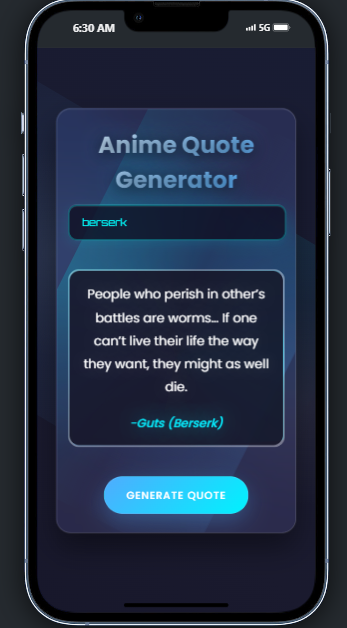

# 🎌 Anime Quote Generator

A fun little web app that fetches and displays random anime quotes based on the anime title you type. If the anime isn’t available or there’s an error, a custom fallback message is shown so it still looks clean!

---

## 💡 Features

- 🔍 Search quotes by anime name
- 🧠 Smart fallback when anime isn’t found
- 🎲 Random anime option (internal function)
- 🚫 Rate limit & error handling
- ⚡ Smooth loading animation on button click

---

## 🖼️ Preview

 <!-- Optional: Replace with your screenshot -->

---

## 🛠️ How It Works

1. You type an anime name in the input box.
2. Click the **Generate Quote** button.
3. App fetches quotes using the [Animechan API](https://animechan.io/).
4. A random quote and character name is displayed.
5. If anything breaks (API error, bad anime name), it shows a default message like:
